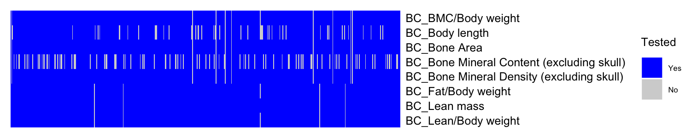
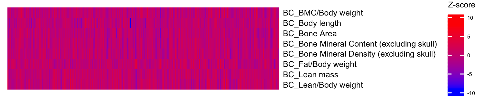

<!-- README.md is generated from README.Rmd. Please edit that file -->

# kompute

<!-- badges: start -->
<!-- badges: end -->

## Overview

The `kompute` R package is specifically designed to handle the
imputation of missing summary statistics in high-throughput model
organism data, such as the International Mouse Phenotyping Consortium
(IMPC) dataset. Despite the IMPC’s extensive gene-phenotype cataloging
efforts, exploring the entirety of the mouse genome remains a formidable
task due to the volume of potential gene-phenotype pairs and the
constraints of resource and time-intensive testing in a controlled
environment. Certain gene knockouts can lead to early embryonic
lethality or developmental abnormalities, rendering numerous phenotypes
unmeasurable. Consequently, the IMPC dataset, though rich, is still
considerably incomplete. `kompute` addresses this by leveraging the
conditional distribution properties of multivariate normal data,
allowing it to impute missing phenotype association statistics directly.
The method employs only the summary statistics of measured phenotypes
and the corresponding estimated phenotype correlations as proxies for
genetic correlations between phenotypes.

## Citing kompute

Warkentin et al. KOMPUTE: Imputing summary statistics of missing
phenotypes in high-throughput model organism data. bioRxiv. doi:
<https://doi.org/10.1101/2023.01.12.523855>

## Authors

Donghyung Lee <leed13@miamioh.edu> and Coby Warkentin
<warkenca@miamioh.edu>

## Installation

To install the kompute package, start R and enter the following
commands:

``` r
# install.packages("devtools")
devtools::install_github("dleelab/kompute")
```

## Examples

Below is a basic example illustrating the usage of the kompute()
function to impute missing Z-scores in IMPC Body Composition summary
statistics data (BC_Zscore_Mat). This example utilizes estimated
phenotype correlations (BC_Pheno_Cor) as proxies for genetic
correlations between the Body Composition phenotypes.

``` r
library(kompute) # all example datasets will be automatically loaded
library(ComplexHeatmap)

#str(BC_Zscore_Mat) # association z-score matrix of Body Composition data
#str(BC_Pheno_Cor)  # Body Composition phenotype correlation matrix

BC_Zmat <- BC_Zscore_Mat[1:500,] # we only use the first 500 genes

# Calculate the percentage of missing Z-scores in the data 
pct_missing <- 100*sum(is.na(BC_Zmat))/(nrow(BC_Zmat)*ncol(BC_Zmat)) 
pct_missing
#> [1] 4.975
```

#### Visualization of Phenotype-Gene Coverage

The heatmap illustrates tested (blue) and untested (light gray)
gene-phenotype pairs.

``` r
# Generate a matrix indicating where z-scores are present
id.mat <- 1*(!is.na(BC_Zmat)) # multiply 1 to make this matrix numeric

ht1 = Heatmap(t(id.mat), 
             cluster_rows = F, 
             cluster_columns = F,
             show_row_dend = F, show_column_dend = F,  # do not show dendrogram
             #show_column_names = F, col = c("white","red"),
             show_column_names = F, col = c("lightgray", "blue"),
             row_names_gp = gpar(fontsize = 6), name="Tested",
             heatmap_legend_param = list(labels = c("Yes", "No"),
                                         title_gp = gpar(fontsize = 6), 
                                         labels_gp = gpar(fontsize = 4)))
draw(ht1)
```



#### Run kompute()

We use kompute() to impute the missing Z-scores in the Z-score matrix.

``` r
kompute.res <- kompute(BC_Zmat, BC_Pheno_Cor)
```

#### Results

The `kompute` function produces a list consisting of two matrices: i)
the Z-score matrix, and ii) the corresponding imputation information
matrix. For the measured Z-scores, the information is set to NA, while
the imputed Z-scores contain information values ranging between 0 and 1.

``` r
head(kompute.res$zmat[,1:3])    # Z-score matrix
#>      BC_BMC/Body weight BC_Body length BC_Bone Area
#> [1,]         -0.6553998     -1.6404679   -0.2415052
#> [2,]          0.1949131     -0.5418602   -0.5630102
#> [3,]         -0.2398292     -0.3960885   -3.0121842
#> [4,]         -0.1703480     -3.6834565   -0.3905398
#> [5,]         -1.0319219      0.6519419   -1.7038746
#> [6,]          1.7459897     -0.5004111    1.2329180
head(kompute.res$infomat[,1:3]) # imputation information matrix
#>           [,1]      [,2]     [,3]
#> [1,]        NA        NA       NA
#> [2,] 0.4360353 0.4494443 0.203262
#> [3,] 1.0000000 0.5220450 1.000000
#> [4,]        NA        NA       NA
#> [5,] 1.0000000 1.0000000 1.000000
#> [6,]        NA        NA       NA

ht2 = Heatmap(t(kompute.res$zmat), 
             cluster_rows = F, 
             cluster_columns = F,
             show_row_dend = F, show_column_dend = F,  # do not show dendrogram
             show_column_names = F, col = c("blue", "red"),
             row_names_gp = gpar(fontsize = 6), name="Z-score",
             heatmap_legend_param = list(title_gp = gpar(fontsize = 6), 
                                         labels_gp = gpar(fontsize = 4)))
draw(ht2)
```



For more detailed analysis examples demonstrating the effectiveness of
the `kompute` imputation method, please visit our examples page
([komputeExamples](https://statsleelab.github.io/komputeExamples/)).
